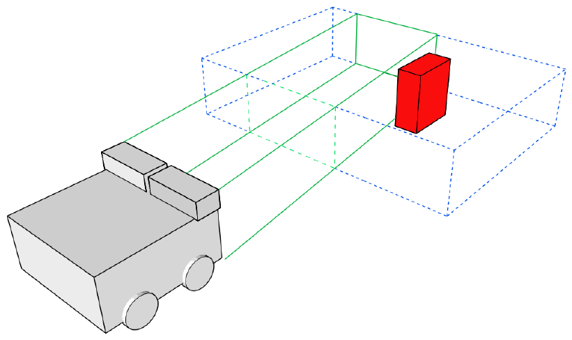

# Stereoscopic machine vision method on a vehicle

## Abstract

The goal of the thesis was to examine the implementation of the stereoscopic machine vision in the context of a simple robot. The complete machine vision process was presented starting from the cameras’ calibration, up to generating the depth image, as well as using the generated depth image for collision avoidance in an autonomous vehicle prototype. Appropriate tools were developed to examine the machine vision and collision avoidance processes. The thesis was finalized by implementing the stereo vision and collision avoidance module on a prototype of a vehicle.

**Keywords:** machine vision, stereovision, collision avoidance, autonomous vehicles

The [thesis.pdf](./thesis.pdf) file contains the description of the method along with the results.

## Structure

This repo contains files that are related to the thesis about using a stereo vision method to steer a car model. The implementation is divided into four parts:

* [Image processing](./src/computer_vision)
* [Camera & stereo rig calibration](./src/calibration)
* [Vehicle control](./src/vehicle)
* [Collision avoidance](./src/collision_avoidance)
* [Set of tests for the model](./test)
